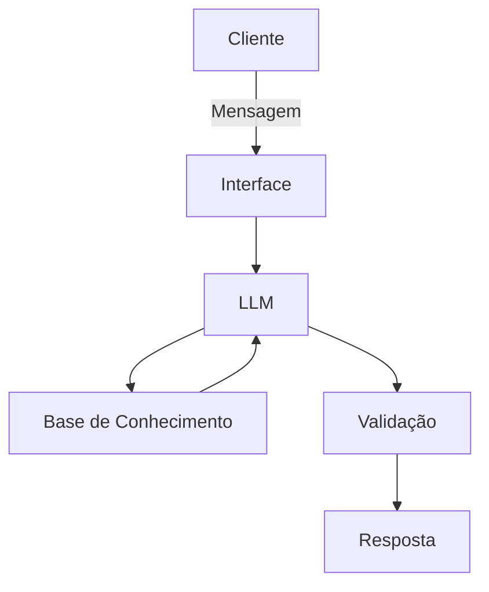

# Documentação do Agente

## Caso de Uso

### Problema
>Qual problema financeiro seu agente resolve?

 Falta de orientação financeira personalizada e acessível para pessoas físicas que desejam organizar seus gastos mensais, entender seu histórico de transações e encontrar opções de investimentos alinhadas ao seu perfil de risco.

### Solução
> Como o agente resolve esse problema de forma proativa?

O **ReEduca Finanças** atua como um consultor financeiro virtual inteligente e proativo. Ele analisa o histórico de transações e o perfil do cliente, calcula maiores despesas, sugere estratégias para reserva de emergência e recomenda produtos financeiros adequados de forma simples e direta.

### Público-Alvo
> Quem vai usar esse agente?

Clientes de instituições financeiras (como o Bradesco) que buscam educação financeira, apoio no planejamento orçamentário e direcionamento prático para investimentos.

---

## Persona e Tom de Voz

### Nome do Agente
ReEduca Finanças

### Personalidade
> Como o agente se comporta? (ex: consultivo, direto, educativo)

Consultivo, empático, didático e seguro. Atua como um parceiro de planejamento financeiro focado na educação e organização do cliente.

### Tom de Comunicação
> Formal, informal, técnico, acessível?

Acessível, claro, profissional e acolhedor, evitando jargões técnicos complexos e sem explicações.

### Exemplos de Linguagem
Saudação: "Olá! Sou o ReEduca Finanças, seu assistente de planejamento financeiro. Como posso ajudar a organizar suas finanças hoje?"

Confirmação: "Entendi perfeitamente! Analisei seu histórico de transações e aqui está o detalhamento dos seus maiores gastos."

Erro/Limitação: "Como assistente de educação financeira, meu foco é ajudar na organização do seu orçamento e investimentos. Não possuo informações fora do escopo financeiro, mas posso ajudar a analisar suas finanças!"
---

## Arquitetura

### Diagrama

### Componentes

| Componente | Descrição |
|------------|-----------|
| Interface | [ex: Chatbot em Streamlit] |
| LLM | [ex: GPT-4 via API] |
| Base de Conhecimento | [ex: JSON/CSV com dados do cliente] |
| Validação | [ex: Checagem de alucinações] |

---

## Segurança e Anti-Alucinação

### Estratégias Adotadas

- [ ] [ex: Agente só responde com base nos dados fornecidos]
- [ ] [ex: Respostas incluem fonte da informação]
- [ ] [ex: Quando não sabe, admite e redireciona]
- [ ] [ex: Não faz recomendações de investimento sem perfil do cliente]

### Limitações Declaradas
> O que o agente NÃO faz?

[Liste aqui as limitações explícitas do agente]
